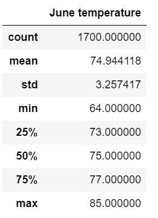
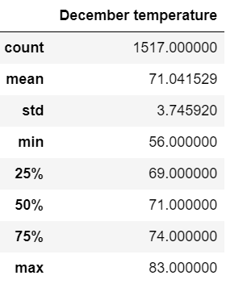
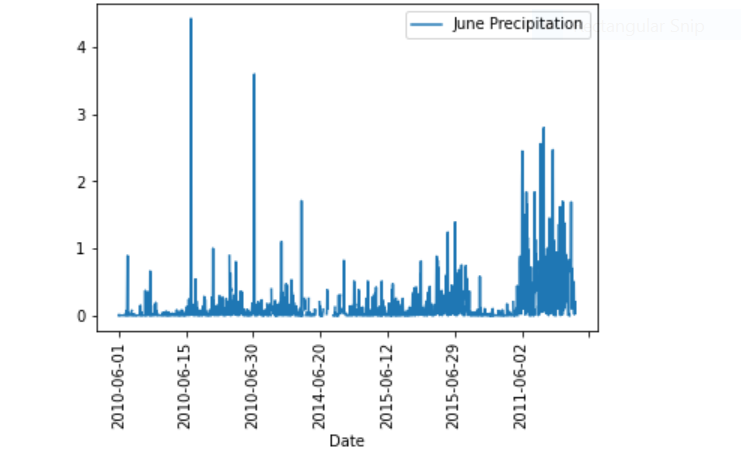
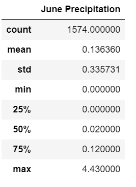
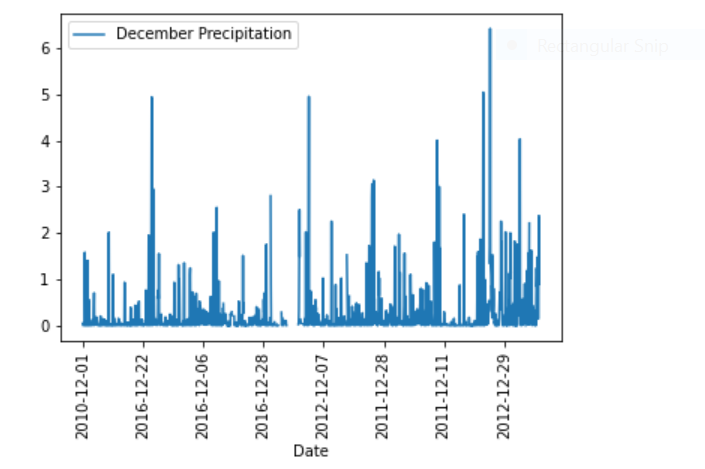
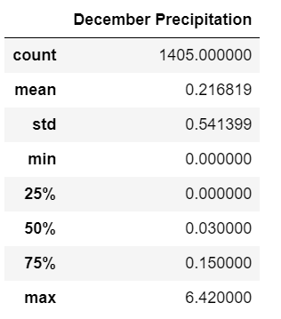

# surfs_up
Using Sql lite, Sql Alchemy and Flask 
## 1. OVERVIEW
This is an analysis information to provide W. Avy , the temperature trends before opening the surf shop. Specifically, he wants temperature data for the months of June and December in Oahu, in order to determine if the surf and ice cream shop business is sustainable year-round.
## 2. Analysis Results
**JUNE  AND DECEMBER MONTH TEMPERATURES STATISTICAL SUMMARY**

       

- The Average temperatures for month June and December are **74.9 and 71.04
- The Minnium tempreatures for month June and December are **64 and 56**
- The Maximum tempreatures for month June and December are **85 and 83**
These months look like the they have reasonable tempreatures  for tourists to visit , which is one of the factors to support for investing and opening  up surf shop.

## 3. Additional Analysis for the Month of June and December with Precipitation Information

By understanding  the combination of  Precipation factors along with the  temperatures for the month , better decisions can be made to 
determine if the surf and ice cream shop business is sustainable year-round.Below data shows Precipitation  plot and statistics for june and december

                        

                

**FYI** 
*CODE  for June month precipitation - 
June_prcp = session.query(Measurement.date, Measurement.prcp).filter(extract('month', Measurement.date) == 6)*

*CODE  for December month precipitation
dec_prcp = session.query(Measurement.date, Measurement.prcp).filter(extract('month', Measurement.date) == 12)*
